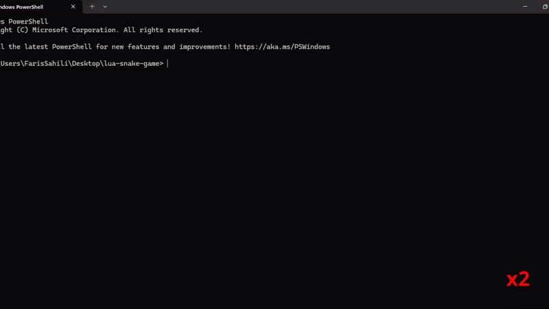

#  Lua Snake Game

This project is a simple but complete implementation of the classic **Snake Game** using modern programming patterns in **Lua**, designed specifically to demonstrate fundamental concepts in **game development**.

Built on the powerful and lightweight **Love2D game framework**, the game follows clean architectural patterns such as:

- **State Management** (for separating menu/gameplay logic),
- **Entity-Component Systems (ECS)** (for handling snake properties),
- **Command Pattern** (for flexible input control), and
- **Observer/Event System** (bonus challenge to decouple logic).
A simple Snake Game implemented using **modern Lua patterns** and **Love2D** game framework.
---

## Demo



---

##  Features

-  **Game State Manager** (Menu & Playing)

-  **Entity-Component System** for modular design

-  **High Score System** using Lua 5.4 `to-be-closed`

-  **Vector2 Class** with custom metamethods (`__add`, `__eq`, `__tostring`)

-  **Snake Game Mechanics** (movement, food, collision, scoring)

-  **Command Pattern** for input handling

-  **(Bonus)** Simple Observer Pattern for events

---


##  Run the Game

Make sure you have [LÖVE 2D](https://love2d.org/) installed.

Then run the game using the following command in your terminal:

```bash
love .
```

##  Project Structure

```
snake_game/
├── main.lua             # Entry point of the game
├── gamestate.lua        # Game state manager
├── entity.lua           # Basic entity system
├── vector2.lua          # 2D vector math utilities
├── highscore.lua        # High score save/load handler
├── input.lua            # Input event handler
├── events.lua           # Event system 
├── snake_game.lua       # Core game logic
└── states/
    ├── menu_state.lua   # Main menu screen
    └── game_state.lua   # In-game logic and rendering
```
